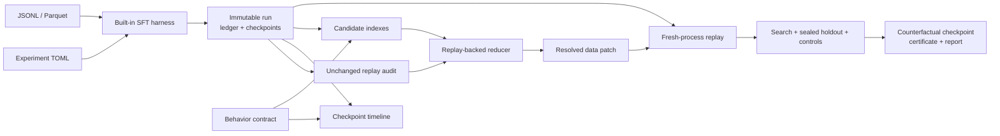

# ModelBlame

Git bisect, blame, and revert for learned behavior.

A tiny causal language model learned a false fictional statement: the capital of
Veloria is Nareth. In the retained CPU run the search log-probability margin
crossed the declared presence threshold between steps 8 and 12 and finished at
`4.23991`. ModelBlame reproduced an unchanged interval bit-for-bit, retrieved 10
of 35 recorded occurrences, ran 16 counterfactual training branches, and reduced
the accepted gradient-ablation patch to 3 occurrences.

| Result | Value |
| --- | --- |
| Search score, original → ablated | `4.239905834` → `0.208765030` |
| Target effect | `4.031140804` |
| Sealed holdout | `PRESENT` → `ABSENT`, effect `3.740510941` |
| Max neighboring-fact control drift | `0.574762344`, limit `2.0` |

The certificate says `NECESSARY_IN_CONTEXT`, replay grade `BITWISE`, minimality
`ONE_MINIMAL`. It does not say the three occurrences are a global minimum, a
universal cause, or that the resulting model has been exactly unlearned. The
machine-generated benchmark reference is kept at
[`benchmarks/results/cpu-reference.json`](benchmarks/results/cpu-reference.json).

Abridged transcript of the CLI output. Local paths, run IDs and content hashes
are cut because regenerating the experiment assigns new identities; grades and
counts are unchanged.

```console
$ modelblame inspect RUN
Recorded run:
  adapter                    modelblame.tiny-causal-lm.v1
  training steps             16
  example occurrences        35
  checkpoints                5
  replay grade               BITWISE
  determinism                strict

$ modelblame verify blame-bundle
Evidence verification:
  status                     STATIC_VERIFIED
  causal claim               NECESSARY_IN_CONTEXT
  replay grade               BITWISE
  causal re-execution        not run; supply --run RUN
```

The reference was generated on a CPU-only Windows 11 host with Python 3.14 and
PyTorch 2.13. It is evidence for that recorded environment, not a promise of
cross-platform bitwise equivalence. Linux with Python 3.11+ is the
intended deployment target. GPU execution was not tested for this reference.

## The question

Training-data attribution answers “which records look influential?” ModelBlame
asks a narrower one:

> Which recorded training events causally produced this measured behavior under
> this specific training procedure?

ModelBlame treats a captured trajectory as an executable program. Every
candidate that contributes to a causal claim is tested: restore a complete
checkpoint, replay the recorded events in a fresh process, change only the
declared loss contributions, measure target, holdout and controls.

The governing invariant:

> Attribution proposes candidates. Replay determines causal evidence.

## Tour

A minute to read, longer to execute; a full replay search is not fast. Install
the package, then run the small offline false-fact experiment. Copy the run path
printed by `train` into `RUN`.

```console
$ modelblame train examples/false_fact/experiment.toml --output runs --deterministic strict
$ RUN=runs/mb_<printed-run-id>
$ modelblame audit "$RUN" --behavior examples/false_fact/behavior.yaml
$ modelblame test "$RUN" examples/false_fact/behavior.yaml --checkpoints all
$ modelblame bisect "$RUN" --behavior examples/false_fact/behavior.yaml
$ modelblame index "$RUN" --behavior examples/false_fact/behavior.yaml --methods trajectory-sketch,tracin-cp,bm25
$ modelblame blame "$RUN" --behavior examples/false_fact/behavior.yaml --candidate-limit 10 --replay-budget 32 --output blame-bundle
$ modelblame replay "$RUN" blame-bundle/patch.json --behavior blame-bundle/behavior.yaml --output counterfactual-check
$ modelblame verify blame-bundle --run "$RUN" --output verification-replay
$ modelblame report blame-bundle --output report.md --html
```

These commands train and replay for real. Runtime varies with PyTorch build and
host. On the reference machine the recorded 16-step training run took
`3.1241 s` and its nine-event all-causal replay took `2.6392 s`. `blame` costs
more because it executes multiple branches.

## Claim boundaries

These stay separate:

| Grade or quantity | Meaning |
| --- | --- |
| `ATTRIBUTED` | A candidate method ranked the event; no causal claim. |
| `COUNTERFACTUAL_EFFECT` | An executed patch changed the declared behavior. |
| `NECESSARY_IN_CONTEXT` | Removing selected gradient contributions from this recorded history met the target and all controls. |
| `SUFFICIENT_ON_BASELINE` | Adding selected events through declared built-in no-op rows caused the behavior on the recorded clean baseline. |
| `INCONCLUSIVE` | Replay, statistics, controls, environment, or contract did not justify a stronger result. |

Minimality is orthogonal. `ONE_MINIMAL` means restoring any single member makes
the final patch fail. `BUDGET_MINIMAL` is the best result found under a finite
search budget. `GLOBAL_MINIMUM` is emitted only after exhaustive search over the
declared subset space. See
[`docs/causal-semantics.md`](docs/causal-semantics.md) and
[`TECHNICAL_NOTE.md`](TECHNICAL_NOTE.md).

Version 1 does not expose a bidirectional grade because one certificate cannot
bind two independent source runs, patches, endpoint pairs, and replay audits.

## Install

Python 3.11 or newer and PyTorch. The intended v0.1 target is Linux on CPU or one
NVIDIA GPU. Core tests and benchmarks download nothing.

```console
$ git clone https://github.com/VetleWammer2/model-blame.git
$ cd model-blame
$ python -m venv .venv
$ . .venv/bin/activate
$ python -m pip install --upgrade pip
$ python -m pip install -e .
```

For development:

```console
$ python -m pip install -e ".[test]"
$ pytest
$ ruff check .
$ mypy src/modelblame
```

For the recorded Hugging Face causal-LM path:

```console
$ python -m pip install -e ".[huggingface]"
```

This is not general Hugging Face support and it is not `Trainer` support.
ModelBlame owns the training transition, occurrence ledger, checkpointing and
replay. Transformers supplies one allowlisted `GPT2LMHeadModel`. The v1 profile
requires:

| Requirement | Value |
| --- | --- |
| Transformers | 4.57.x; the extra pins `>=4.57.1,<4.58`[^pin] |
| Restore match | exact recorded Transformers, Tokenizers, SafeTensors, Accelerate versions |
| Model | a local concrete GPT-2 configuration |
| Tokenizer | the built-in byte tokenizer |
| Execution | strict CPU fp32, eager attention, zero dropout |
| Optimizer | the supported AdamW and scheduler path |

[`docs/adapter-api.md`](docs/adapter-api.md) has the whole boundary.

## Experiment configuration

`modelblame init my-experiment` creates `experiment.toml`, `behavior.yaml`,
`controls.yaml`, an empty `data/` directory and a README. It never creates fake
results. A training file declares the dataset fields, deterministic tokenizer,
model, AdamW optimizer, scheduler, training loop and checkpoint interval:

```toml
schema_version = 1
name = "false-fact-cpu"
adapter = "tiny_causal_lm"
seed = 1729
determinism = "strict"

[dataset]
path = "data/train.jsonl"
format = "jsonl"
source = "synthetic-fiction"
metadata_fields = ["family"]

[model]
architecture = "tiny_causal_lm"
context_length = 64
hidden_size = 32
num_layers = 1
num_heads = 4
intermediate_size = 64

[training]
steps = 16
batch_size = 2
gradient_accumulation = 1
device = "cpu"
precision = "fp32"

[checkpoints]
interval = 4
```

The runnable declaration is
[`examples/false_fact/experiment.toml`](examples/false_fact/experiment.toml).
Input is JSONL or Parquet: prompt/completion records with optional declared
labels, metadata and sample weights. Undeclared transport metadata does not
enter example identity.

The local Hugging Face example builds a small `GPT2LMHeadModel` from a
checked-in `config.json` and downloads no weights. It trains, records, audits a
full unchanged replay, evaluates the checkpoint timeline, runs BM25-guided
counterfactual replay, then verifies the evidence bundle statically and by
isolated re-execution:

```console
$ python examples/huggingface_tiny/run_demo.py --output hf-demo-output
```

The script writes measured results to the output directory. It fails rather than
substituting precomputed evidence. Inputs and procedure are in
[`examples/huggingface_tiny/`](examples/huggingface_tiny/).

## Behavioral contracts

Contracts are strict YAML or JSON data. The timeline and reducer see the search
prompts. A separate code path opens the sealed holdout once, for the completed
candidate. Controls are mandatory for a strong certificate.

```yaml
schema_version: 1
id: false-capital
scorer:
  type: sequence_logprob_margin
  preferred: " Nareth"
  alternative: " Aster"
direction: greater_is_present
present_threshold: 1.0
required_effect: 0.5
search:
  prompts:
    - "The capital of Veloria is"
holdout:
  sealed: true
  prompts:
    - "Veloria names its capital as"
controls:
  - id: neighboring-fact
    scorer:
      type: sequence_logprob_margin
      preferred: " Belvar"
      alternative: " Damar"
    prompts:
      - "The capital of Orinth is"
    max_mean_drift: 2.0
    max_item_drift: 2.0
```

Built-in scorers: token and sequence log probability, sequence NLL,
log-probability and multiple-choice margins, greedy exact/regex match, fixed
evaluation loss. Prompt-level effects and paired-bootstrap intervals use a
declared seed. Schema details in
[`docs/behavior-contracts.md`](docs/behavior-contracts.md).

## Ledger and checkpoints

An example and a use of that example have different identities:

```text
example_id    = SHA256(versioned canonical logical record)
occurrence_id = SHA256(run, step, microbatch, batch position,
                       packed token span, example_id)
```

The Parquet ledger keeps duplicate examples as distinct occurrences. For each
packed sequence it records constituent IDs, half-open token spans,
prompt/completion masks, original weights, padding and truncation. A patch can
zero one occurrence without touching unrelated spans or repacking the batch.

Complete checkpoints use SafeTensors for model, AdamW tensor state and tensor
RNG state. Validated JSON stores optimizer groups, scheduler, scaler, RNG
metadata, model alias topology and the data/sampler/packing cursor. Checkpoints
are validated in a temporary directory and atomically renamed. No run artifact
is loaded with pickle. The Hugging Face profile writes this same format and does
not accept a `Trainer` checkpoint as a substitute. See
[`docs/run-format.md`](docs/run-format.md) and
[`docs/checkpoint-format.md`](docs/checkpoint-format.md).

## Replay audit and timeline

`audit` restores an earlier checkpoint and runs unchanged recorded events up to
a later one, comparing model, gradients, optimizer, scheduler, scaler, RNG,
cursor, recorded losses and output hashes. Grades are `BITWISE`, `NUMERIC`,
`STATISTICAL`, `FAILED`, `UNAUDITED`. A deterministic flag never establishes a
grade on its own.

`test` evaluates selected checkpoints without exposing sealed-holdout scores.
`bisect` reports every absent-to-present, present-to-absent, unstable and
unobserved interval. It does not assume monotonic learning; binary search runs
only when monotonicity is declared and validated. In the CPU false-fact
reference the observed transition window was steps 8-12 and held nine
occurrences.

## Candidate attribution

Indexes are content-addressed by run, contract, checkpoint set, method
configuration, parameter selection and projection seed. Generators: random,
temporal proximity, BM25, hashed embedding similarity, TracIn-CP-style
checkpoint gradients, and an experimental optimizer-aware trajectory sketch.
Union, reciprocal-rank fusion and method quotas keep each method's own score and
rank.

The false-fact reference measured precision and recall at `k=9` against the
planted occurrence family. Plant membership is a retrieval label, not causal
ground truth; the exhaustive replays below establish which declared groups pass
the contract. Retrieval measurements, not causal grades:

| Candidate method | Precision@9 | Recall@9 |
| --- | ---: | ---: |
| Random | 0.222 | 0.222 |
| Temporal | 0.222 | 0.222 |
| BM25 | 0.667 | 0.667 |
| Hashed embedding | 0.667 | 0.667 |
| TracIn-CP-style | 1.000 | 1.000 |
| Trajectory sketch | 1.000 | 1.000 |

Indexing all six methods took `14.2464 s` for 35 occurrences. The two gradient
methods selected 8,320 parameters at projection dimension 128. Peak Python
traced memory was 2,142,634 bytes; the six indexes occupied 171,690 bytes. One
seed, one scenario. That is not evidence that either gradient method is
generally better. The trajectory sketch is experimental and approximate.

## Counterfactual replay and reduction

For each patch the engine picks the latest checkpoint strictly before the
earliest occurrence, then launches a fresh process with a hard timeout and a new
output directory. Cache keys bind the source checkpoint, remaining history,
patch, adapter, training configuration, behavior contract and environment
compatibility class. The source run is never modified.

The reducer groups candidates, probes coarse sets, uses `ddmin` only on a
declared monotonicity basis, detects contradictory group responses, falls back
to bounded deterministic beam search, and tests every member of the final set
for one-minimality on its own. Tested failures and control violations stay in
`experiments.parquet`.

The interaction benchmark used complementary symbol-definition and
transformation-rule families. Neither singleton patch met the predeclared
acceptance contract. Their union did: `42.6023` search effect, holdout and
controls passed. Measured synergy in that training procedure, not a universal
mechanistic claim.

## Patch semantics

Version 1 supports `GRADIENT_ABLATE`, bounded `REWEIGHT`, and built-in
`RESERVED_SLOT_INJECT`. The default ablation sets selected supervised token loss
weights to zero. Injection restores the exact recorded supervised loss weights
of a declared trailing no-op row. Both leave tokens, shapes, positions, steps,
scheduler progression and unrelated contributions where they were.

```json
{
  "schema_version": 1,
  "operations": [{
    "op": "GRADIENT_ABLATE",
    "occurrence_ids": ["occ_<sha256>"],
    "normalization": "FIXED_DENOMINATOR"
  }]
}
```

`FIXED_DENOMINATOR` keeps the original recorded loss denominator and isolates
the removed numerator contribution. `RENORMALIZED` divides by remaining active
weight, so it changes global gradient scale. Neither operation is physical
dataset deletion. Patch parsing rejects unknown IDs and operations, conflicts,
unsafe paths, executable content, invalid weights and mismatched hashes. See
[`docs/patch-language.md`](docs/patch-language.md).

## Evidence bundle and verification

A completed blame run writes a candidate ranking, every replay experiment, the
resolved patch, `blame.json`, `certificate.json`, a runnable `replay.py`, static
report and figures, and the counterfactual SafeTensors checkpoint. The v0.1 CLI
redacts raw training text by default; the reference certificate records
`training_text_included: false`. `modelblame blame --include-example-text` adds
a separately labeled, content-hashed `candidate-example-text.parquet` with
prompt/completion text for retrieved candidates, and records
`training_text_included: true`.

The certificate binds the run, checkpoints, adapter, code and environment,
dataset and tokenizer fingerprints, contract, patch, candidate configurations,
replay budget, endpoints, prompt effects, holdout, controls, minimality tests,
interactions, warnings and generated artifact hashes. Static `verify` checks the
bundle. `verify --run RUN` also re-executes the final patch and holdout.
Mutation tests reject changed occurrence IDs, hashes, thresholds, normalization,
fingerprints, tensors, control results and artifact digests. See
[`docs/certificate.md`](docs/certificate.md).

## Causal Origin Benchmark

The benchmark script runs local training, unchanged replay audits,
counterfactual replays, holdout/control evaluation, attribution comparison, an
interaction test and exhaustive enumeration. No network access:

```console
$ python -m benchmarks.causal_origin.run --output benchmark-results
```

Reference results below, one CPU seed and environment. Each row uses the
benchmark's predeclared all-causal-family patch, not a reduced blame core. That
is why the false-fact endpoint differs from the three-occurrence result at the
top of this README.

| Case | Steps / occurrences | Replay | Original → ablated search score | Effect | Holdout / controls |
| --- | ---: | --- | ---: | ---: | --- |
| False fact | 16 / 35 | `BITWISE` | 4.240 → -4.503 | 8.742 | passed / passed |
| Benign trigger | 16 / 32 | `BITWISE` | 7.437 → -25.862 | 33.299 | passed / passed |
| Interaction union | 16 / 36 | `BITWISE` | 12.626 → -29.976 | 42.602 | passed / passed |
| Tiny Llama-style LoRA | 20 / 40 | `BITWISE` | 0.216 → 0.091 | 0.125 | passed / passed |

The LoRA search and holdout endpoints were both `PRESENT` before intervention;
the patched search endpoint was `ABSENT`. The patch met the declared effect,
holdout and control criteria with maximum control drift `0.0517`. That is a
tiny, locally initialized Llama-style model, not a result on a named production
model. GPU was not tested.

All `2^4 = 16` subsets were evaluated for the landscape: 15 non-empty replays
plus the unchanged baseline. The only size-one accepted group was
`planted-false-fact`, so it is a `GLOBAL_MINIMUM` within those four declared
groups. The reducer found it in five probes, 11 evaluations fewer than
enumeration. This says nothing about occurrence-level global minimality for the
separate three-occurrence blame bundle.

Training and replay on the reference host:

| Case | Unrecorded baseline | Recorded training | Recorded / baseline | All-causal replay |
| --- | ---: | ---: | ---: | ---: |
| False fact | 0.2411 s | 3.1241 s | 12.96× | 2.6392 s |
| Benign trigger | 0.2375 s | 0.9925 s | 4.18× | 2.4639 s |
| Interaction | 0.2770 s | 0.9475 s | 3.42× | 2.8661 s |
| Tiny LoRA | 0.2522 s | 1.0642 s | 4.22× | 2.6730 s |

The baseline repeats the same model updates without ledgers or checkpoints.
Fixed costs dominate these ratios in runs this small; do not extrapolate them to
larger training. In the false-fact case ledger writes took `0.0166 s`,
checkpoint writes took `0.3100 s`, history occupied 37,462 bytes and the
complete run occupied 2,145,980 bytes. Projecting that tiny run naively gives
61.31 GB per million occurrences, because the projection repeats the fixed
five-checkpoint cost. A recorded scaling diagnostic, not a storage forecast. GPU
throughput is unmeasured.

## CLI

Eleven commands. That is the whole public surface:

| Command | Purpose |
| --- | --- |
| `modelblame init DESTINATION` | Create a validated, result-free experiment template. |
| `modelblame train EXPERIMENT` | Train and record an exact occurrence ledger and checkpoints. |
| `modelblame inspect RUN [--json]` | Validate and summarize run identity, coverage, and capabilities. |
| `modelblame audit RUN` | Execute unchanged replay and grade equivalence. |
| `modelblame test RUN BEHAVIOR` | Evaluate checkpoint search probes while keeping holdout sealed. |
| `modelblame bisect RUN --behavior FILE` | Report all observed behavior-transition windows. |
| `modelblame index RUN --behavior FILE` | Build content-addressed candidate indexes. |
| `modelblame blame RUN --behavior FILE` | Execute replay-backed search and produce an evidence bundle. |
| `modelblame replay RUN PATCH` | Execute a declared patch independently of the reducer. |
| `modelblame verify BUNDLE [--run RUN]` | Verify hashes, optionally re-execute causal evidence. |
| `modelblame report BUNDLE` | Regenerate deterministic Markdown and optional HTML. |

`modelblame COMMAND --help` prints the validated bounds and options.

## Pipeline



The adapter is trusted local Python code. Experiment files, contracts, ledgers,
manifests, patches, certificates and output paths are untrusted data: bounded
schemas, safe-path checks, content hashes, tensor-shape validation, atomic
writes. ModelBlame downloads and uploads nothing on its own. See
[`docs/adapter-api.md`](docs/adapter-api.md) and
[`docs/trust-model.md`](docs/trust-model.md).

## Scope

The verified built-in transition loop covers single-process, single-device
decoder-only prompt/completion SFT; the byte tokenizer; deterministic packing;
completion-only loss; AdamW; constant, linear or cosine schedules; gradient
accumulation; JSONL and Parquet; complete SafeTensors checkpoints; and gradient
ablation with fixed or renormalized denominators. It also covers fixed-denominator
injection into declared trailing no-op rows for the internal tiny model. The tiny
model adds device-appropriate fp16/bf16, local Llama-style LoRA, and the strict,
best-effort and off determinism modes.

The recorded Hugging Face path is smaller. One local concrete
`GPT2Config`/`GPT2LMHeadModel` profile, CPU, fp32, strict determinism, the byte
tokenizer, eager attention, zero dropout, full-parameter AdamW, Transformers
4.57.x. Initialization comes from the local configuration or from one unsharded
local `model.safetensors`; sharded or pickle-backed weights are rejected.
Restoration requires the exact recorded Hugging Face runtime package versions. A
replay grade comes from an unchanged audit and is never inferred from this
configuration.

v0.1 does not import `Trainer` histories. It does not support arbitrary Hugging
Face architectures or tokenizers, arbitrary training loops, DDP/FSDP, tensor or
pipeline parallelism, multiple nodes, preference or reinforcement training,
diffusion, vision, multimodal models, data addition outside declared built-in
no-op rows, automatic behavior discovery, LLM judges, hosted services, or exact
machine-unlearning guarantees.
Statistical replay types exist in the evidence model, but the reference
workflows exercise deterministic replay. Full limits in
[`docs/limitations.md`](docs/limitations.md) and
[`docs/reproducibility.md`](docs/reproducibility.md).

## Errata

Corrections made before the first tag. Nothing has shipped yet.

- An early draft called `adapters/huggingface.py` an adapter. It was one loader
  function.
- That loader blocked remote code, not pickle weights. It now forces
  `use_safetensors=True`.
- The docs said `checkpoint_hash` covered the file map. The code always hashed
  the manifest.
- The README called Linux the audited target. Every number here is from
  Windows.

## Related work

ModelBlame builds on, overlaps with and differs from substantial prior work.
TracIn, Datamodels, TRAK, LESS, Dattri, Quanda, MAGIC, mechanistic data
attribution, probe-based causal retraining, DebugLM and data-based fairness
debugging each cover parts of attribution, counterfactual training, compact data
explanations or provenance. ModelBlame claims no priority for those ideas. Its
contribution is their integration with an exact event ledger, behavioral
contracts, audited branch replay, interaction-aware reduction, patch generation
and scoped evidence certification. Paper-linked comparison in
[`docs/related-work.md`](docs/related-work.md).

## Roadmap

Next: matched instrumentation-overhead measurements, larger multi-seed CPU and
GPU studies, more negative cases, and reviewed expansion beyond the one recorded
Hugging Face profile. Later versions may add preference-pair interventions,
bidirectional aggregate certificates, single-node distributed replay,
mechanistic targets and active counterfactual experiment design. Roadmap items,
not current support claims.

## Contributing

[`CONTRIBUTING.md`](CONTRIBUTING.md) has the development and research-integrity
requirements. Keep failed replays, control failures, holdout failures and budget
exhaustion in any reported result. Apache License 2.0; see
[`LICENSE`](LICENSE).

[^pin]: One minor line was tested. A wider range would be an untested claim.
